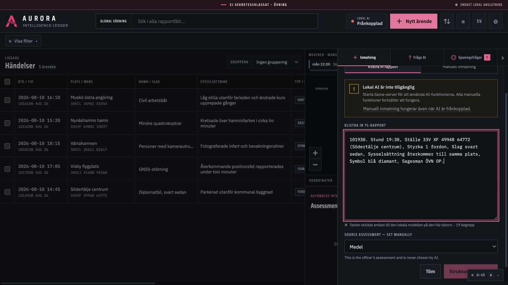
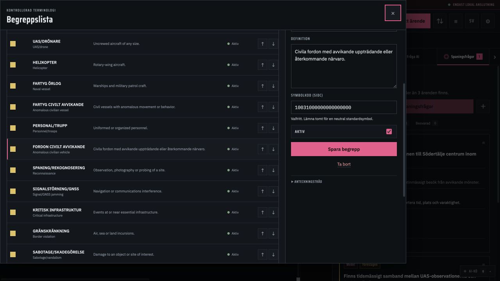
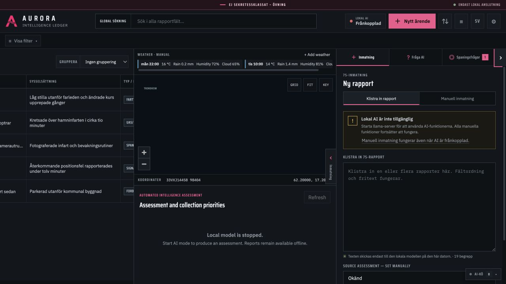
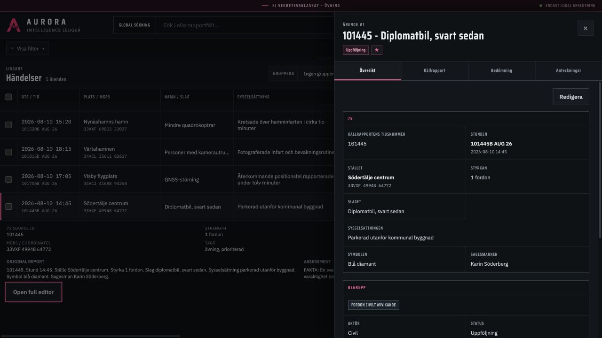
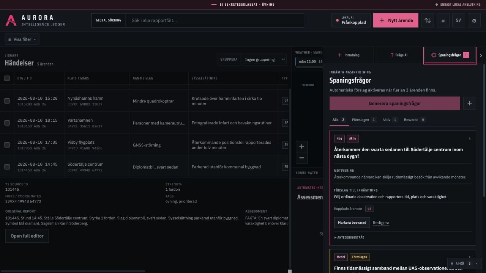
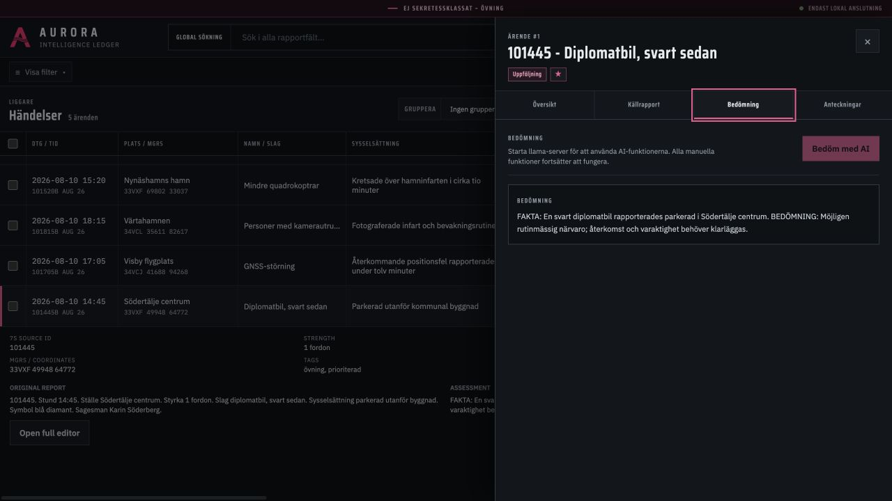

# AURORA INTEL — user guide

[Documentation home](../INDEX.md) · [User documentation](INDEX.md) · [Start and stop](START.md) · [Technical documentation](../technical/INDEX.md)

Aurora Intel is a local intelligence ledger for structured 7S observations. Its table, map, search, exports, and AI run on this computer. It uses no account or runtime internet connection. The app listens only on `127.0.0.1`, meaning "this computer."

AI results are drafts. An officer must verify every field, assessment, and collection question. Aurora cannot determine that a report is true and does not replace orders, source evaluation, protective-security rules, or established reporting/emergency channels.

> All screenshots use synthetic exercise data. The interface is shown in Swedish; switching language changes the labels but not the layout. The local model is deliberately stopped in several screenshots to show which manual functions remain available.

## USB workflow on a disconnected computer

| Step | macOS | Windows |
|---|---|---|
| **1. Trusted connected computer: create/export** | Run `./scripts/prepare_release.sh` | Run `powershell.exe -NoProfile -ExecutionPolicy Bypass -File .\scripts\prepare_release.ps1` |
| **2. Offline computer: unpack and build/package up** | Copy and unzip locally; double-click `build.command` | Copy locally, choose **Extract All**; double-click `build.bat` |
| **3. Offline computer: start** | Double-click `start.command` | Double-click `start.bat` |

Wait for `OK` after step 2. Then use the Start file in step 3.

Use the trusted internal `aurora-intel-vX.Y.Z-offline.zip`. A normal Git source ZIP does not contain the multi-gigabyte model and cannot pass the offline build. The model and ZIP exceed FAT32's file limit, so USB media needs an approved large-file filesystem (ordinarily exFAT for Mac/Windows) and extraction must support ZIP64. Verify the release digest/signature and trusted-key fingerprint through the organization's separate approved channel; files delivered together cannot authenticate their own sender.

### macOS 13+

1. Disable Wi-Fi and disconnect Ethernet when performing an air-gap test.
2. Copy the ZIP from USB to a normal writable local folder.
3. Unzip it and open the extracted Aurora folder.
4. Double-click `build.command`. Use macOS's normal Open confirmation for the trusted internal package if prompted; do not globally disable Gatekeeper.
5. Wait for `OK`. Build checks every checksum, initializes the database, validates coordinate conversion, and runs a tiny grammar-constrained model completion. First model load can take several minutes.
6. Double-click `start.command`. The default browser opens the printed address, normally `http://127.0.0.1:8474`.

### Windows 10/11 x64

1. Disable networking when performing an air-gap test.
2. Copy the ZIP locally, right-click it, and choose **Extract All**. Do not run scripts inside Explorer's compressed-folder view.
3. Open the extracted folder and double-click `build.bat`; wait for `OK`.
4. Double-click `start.bat`; the browser opens the printed `127.0.0.1` address.

Administrator privileges should not be required. If build reports a missing `checksums.txt`, runtime, llama-server, npm store, or GGUF model, this is not a complete release. Do not download anything on the target. Return it to the release maintainer, who must run `prepare_release` on an online build computer.

## Start and stop

- Use `start.command`/`start.bat`. Starting an already running instance just reopens its current URL.
- Use `stop.command`/`stop.bat`. Working data, installed state, and exports remain.
- Closing the browser tab does not stop the local processes.
- If a port is busy, Aurora selects the next free loopback port and prints the exact URL.

Terminal override:

```text
start --port 9090 --llm-port 9091
```

This changes ports, never the `127.0.0.1` bind address.

## Enter a 7S report

1. Open **Input** and **Paste 7S report**.
2. Paste a labelled list or unstructured prose; one paste may contain several reports.
3. Select **Structure with AI**. The visible job can be pending/running/done/failed and is cancellable.
4. Review each preview card against the original. Correct uncertain time, place, count, type, source, and vocabulary values; verify that multiple events were split correctly.
5. Select **Save to ledger** on each accepted report. AI output is never committed before this action.



Use manual entry when the LLM is unavailable or to start with a blank form. All non-AI functionality remains usable.

Aurora preserves original time/place strings. Relative times are marked uncertain. A supplied MGRS or WGS84 position is converted locally; a place name is not silently turned into an exact coordinate. Reports without a validated point remain valid and show **⚑ Position missing**. Use **Add position** to supply MGRS or latitude/longitude and review both formats.

The active **Vocabulary** is the only source for `begrepp`. If no item fits, use `ÖVRIGT/OKÄNT`. Deactivating an item preserves historical cases; the fallback cannot be deleted/deactivated.

SIDC is optional when creating a vocabulary term. Leaving it blank assigns the neutral default symbol.



## Ledger and map

The table and map share the same filtered selection. Search includes the raw report. Filter by date, vocabulary, status, tags, star, actor, missing position, or current map extent; group by vocabulary, status, day, tag, or 10 km MGRS square. Open a case for original text, validated AI JSON, assessment, and notes.





Row selection highlights the corresponding marker and marker clicks open cases. The local map is schematic: do not use it for navigation, boundary adjudication, operationally precise distance, or targeting. Cursor output shows MGRS and WGS84 together.

Map markers use only the user-reviewed actor colour: yellow Unknown, red Suspected foreign, green Civilian, or blue Friendly. The controlled vocabulary term is shown beside the colour box. Colour does not itself prove identity or intent.

## Collection questions, Q&A, and assessments

Above the configured case threshold (default: more than 3), AI can propose up to two focused collection questions per run, grounded in real linked case IDs. Review whether each question is concrete, observable, lawful, and closes a real gap. Accept to make it Active, edit it, mark it Answered/Dismissed, and attach notes.



For **Ask AI**, the backend retrieves at most about 40 candidate rows. The answer can only rely on those rows and lists exact cited IDs; click a citation to highlight table/map. If evidence is insufficient, the correct response says so. Pattern overlays require supporting rows and do not imply causation.

**Assess** separates FAKTA from BEDÖMNING, uses the configured likelihood scale, and should test alternative explanations. The default follows R UND 2022: tveksam, möjligen, troligen, sannolik. Knowledge files supply detection context, never additional event facts. Store a result only after human review.



## LLM status and model changes

The status chip shows loading/ready/down. AI controls are disabled with an explanation while unavailable, but manual ledger, map, search, edit, import/export, and notes continue. The local supervisor attempts llama-server restarts with capped backoff.

To use another instruct GGUF, place it in `llm/models/` and select it in Settings. Normal start refuses a model that is not pinned and checksum-manifested. Exceptional launch requires `start --allow-unverified-model`, prints a warning, and must occur inside your organization's approved OS sandbox/VM because GGUF is native-parser input. Model quality/schema behavior varies; verify provenance and rerun extraction and grammar acceptance tests before operational use.

## Persistence, export, and import

SQLite is continuously stored at `data/aurora.db`. Every write refreshes `data/mirror/liggare.csv`. A full workbook backup is made on start and normally every 30 minutes; the newest 20 are retained.

XLSX can contain all/filtered cases plus **Liggare**, **Spaningsfrågor**, and **Begrepp** sheets and is the complete restore format. CSV is UTF-8 with BOM and defaults to semicolon for Swedish Excel. Import first shows column mapping/preview, warns on normalized time + MGRS + type duplicates, and requires merge-or-append confirmation.

## Safe reset (`teardown`)

Normal teardown stops processes and writes `exports/aurora-final-<timestamp>.xlsx` and `.csv`. If either export fails or is empty, deletion does not begin. It then removes working database/logs, unpacked runtime, installed npm modules, target cache, and `config/app.local.json`, while preserving source, built frontend, runtime/llama payloads, models, offline npm store, and `exports`.

- Run `build --restore-latest` for a fresh installation restored from the newest full snapshot.
- `teardown --no-export` explicitly skips the final snapshot.
- `teardown --purge-exports` deletes snapshots too, only after typing `RADERA AURORA` exactly; it is irreversible.

## Settings, editable knowledge, and troubleshooting

Language, operator, banner, likelihood wording, trigger threshold, backup interval, selected model, and ports are overlaid in `config/app.local.json`. Knowledge is editable Swedish Markdown under `knowledge/` and hot-reloads for the next relevant job. Prompt templates and schemas are centralized in the [prompt registry](../technical/PROMPTS.md); changes require review and regression testing.

- **Browser did not open:** open the exact printed `http://127.0.0.1:<port>`, never a hostname or `0.0.0.0`.
- **LLM remains down:** stop/start, confirm the selected `.gguf`, then inspect `data/logs/llama.log` for memory/model errors. Manual features should still work.
- **Checksum failure:** reject the changed/incomplete package and obtain a new internal release.
- **Position conversion fails:** check MGRS zone/band/grid letters and even digit count, or enter validated WGS84.
- **Logs:** remain under `data/logs`; handle them within the approved environment. Full report text is not emitted at info level.

Shortcuts: `/` search, `n` new case, `s` star selection, `?` help. Focus visibility and reduced-motion preferences are respected.
